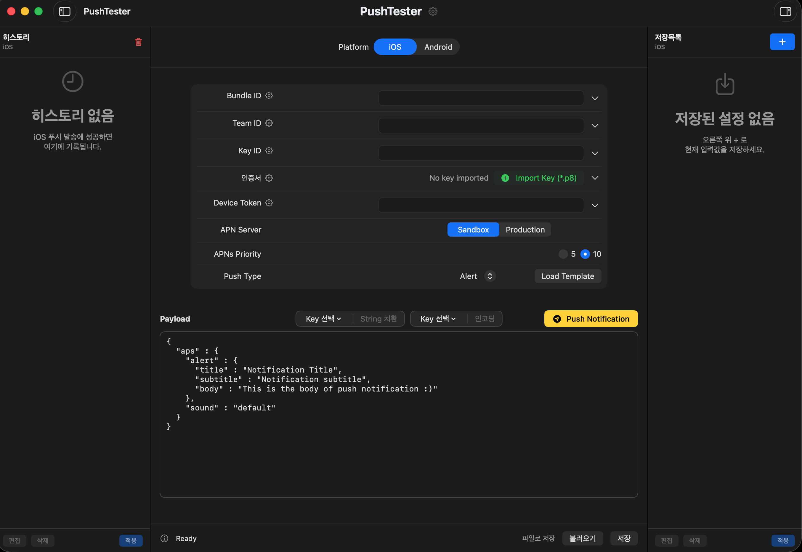

# PushTester

macOS용 iOS(APNs) / Android(FCM) 푸시 테스트 앱입니다.

저장소: [github.com/pkh0225/PushTester](https://github.com/pkh0225/PushTester)



## 기능

- **iOS (APNs)**
  - Auth Key (`.p8`) 임포트
  - Team ID, Bundle ID, Key ID, Device Token
  - Sandbox / Production
  - Priority, Push Type, JSON payload
- **Android (FCM HTTP v1)**
  - Firebase 서비스 계정 JSON 임포트
  - Project ID, FCM Device Token
  - Priority, JSON payload
- **플랫폼 탭 기억**
  - 마지막에 선택한 iOS / Android 탭을 저장해 다음 실행 시 그대로 복원
- **3영역 레이아웃** (`HSplitView`)
  - 왼쪽: 전송 히스토리
  - 가운데: 입력 폼
  - 오른쪽: 앱 내 저장목록
  - 좌·우 패널은 툴바로 접기/펼치기
  - 펼친 패널 기준으로 창 최소 너비 유지
- **Payload 도구**
  - **Key 선택**: 현재 JSON의 key 경로 목록에서 대상 선택
  - **String 치환 / 원복**: 선택한 key의 value를 문자열로 변환 (object/array는 JSON 텍스트). 다시 누르면 원복
  - **인코딩 / 원복**: 선택한 key의 value를 URL percent-encoding. 다시 누르면 원복
  - String / 인코딩 그룹은 각각 독립적인 Key 선택
  - Payload 편집기에서 macOS 스마트 따옴표 치환 비활성화 (`"` 유지)
  - 세션 복원·**Push Notification** 전송 시 스마트 따옴표(`“ ” ‘ ’` 등)를 ASCII `"` / `'` 로 교정
- **필드 프리셋**
  - Bundle ID, Team ID, Key ID, Device Token, Project ID 등 값 목록 관리
  - 인증서(`.p8` / 서비스 계정 JSON) 목록 관리·선택
  - 라벨 옆 ⚙으로 추가·수정·삭제 (변경 시 자동 저장)
  - 입력칸 옆 ▼로 저장된 항목 선택 시 필드에 자동 입력
- **앱 내 설정 저장** (오른쪽 패널)
  - `+` 로 현재 입력값을 이름과 함께 저장
  - 적용 / 편집(이름 포함) / 삭제
  - iOS / Android 탭별 목록 분리
- **전송 히스토리** (왼쪽 패널)
  - 성공한 전송 기록, 적용 / 편집 / 삭제
  - 현재 플랫폼 히스토리 **전체 삭제**
  - iOS / Android 탭별 목록 분리
- **설정** (타이틀바 가운데 `PushTester` 옆 ⚙)
  - **앱 정보** (이름, 버전, 플랫폼, GitHub 링크, 간단한 설명)
  - 설정 목록 UI (`AppSettingsCatalog`로 항목 확장 가능)
  - **전체 데이터 초기화** (히스토리·저장목록·프리셋·인증서 프리셋·마지막 세션·플랫폼 탭·입력 폼)
- 마지막 세션 자동 저장/복원
- 세션 JSON 파일로 저장·불러오기 (하단 버튼)
- 창 크기·위치 기억

## 요구 사항

- macOS 14+
- Xcode 15+ (권장)

## 실행

### 데스크톱 앱

빌드본을 복사해 둔 경우:

```text
~/Desktop/PushTester.app
```

### Xcode에서 빌드

```bash
cd /path/to/PushTester
open PushTester.xcodeproj
```

또는:

```bash
xcodebuild -project PushTester.xcodeproj -scheme PushTester -configuration Debug -destination 'platform=macOS' build
```

Bundle ID: `com.local.PushTester`

## 사용법

### iOS

1. 상단 탭에서 **iOS** 선택 (마지막 선택은 다음 실행 시 자동 복원)
2. Apple Developer에서 발급한 APNs Auth Key (`.p8`) 임포트 (또는 ▼에서 저장된 인증서 선택)
3. Team ID, Key ID, 앱 Bundle ID, Device Token 입력 (자주 쓰는 값은 프리셋으로 저장해 두면 편리합니다)
4. Sandbox / Production 선택
5. Payload 편집 후 **Push Notification**

### Android

1. 상단 탭에서 **Android** 선택
2. Firebase 콘솔의 서비스 계정 JSON 임포트 (또는 ▼에서 저장된 인증서 선택)
3. Project ID, FCM Device Token 확인/입력
4. Payload 편집 후 **Push Notification**

### Payload 도구

Payload 라벨과 Push 버튼 사이 가운데에 두 그룹이 있습니다.

1. **Key 선택**에서 변환할 JSON key 경로를 고릅니다.
2. **String 치환**: int/bool/object/array 등을 문자열로 바꿉니다. object/array는 compact JSON 문자열이 됩니다.
3. 같은 버튼을 다시 누르면 **String 원복**으로 이전 타입을 되돌립니다.
4. **인코딩**: 선택한 value를 URL percent-encoding 합니다. (object/array는 JSON 텍스트로 만든 뒤 인코딩)
5. 다시 누르면 **인코딩 원복**입니다.
6. Payload 편집 중에는 macOS가 `"` 를 스마트 따옴표로 바꾸지 않습니다. 이미 섞여 있는 경우 세션 복원·Push 전송 시 ASCII로 교정됩니다.

### 필드 프리셋

입력 필드의 값을 여러 개 저장해 두고 빠르게 바꿔 쓸 수 있습니다.

1. 라벨 오른쪽 **⚙** 을 눌러 해당 필드 목록을 엽니다.
2. 값을 추가·수정하고, 항목 옆 **x** 로 삭제합니다 (삭제 전 확인).
3. 변경 내용은 자동 저장됩니다.
4. 입력칸 오른쪽 **▼** 에서 항목을 고르면 필드에 바로 채워집니다.

**인증서**도 동일합니다. Import로 가져오거나 설정에서 파일을 추가하면 목록에 남고, ▼로 다시 선택할 수 있습니다.

### 앱 내 설정 저장 (오른쪽)

파일보내기와 별개로, 현재 입력값을 앱 안에 저장해 둡니다.

1. 오른쪽 위 **+** 를 눌러 이름을 지정하고 저장합니다.
2. 목록에서 항목을 선택한 뒤 **적용**으로 폼에 반영합니다.
3. **편집**에서는 저장 시 넣은 **이름**과 설정값을 수정할 수 있습니다 (`저장목록 편집`).
4. **삭제**는 확인 후 진행됩니다.
5. 툴바 오른쪽 저장목록 버튼으로 패널을 접거나 펼칠 수 있습니다.
6. iOS / Android 탭에 따라 목록이 분리됩니다.

### 히스토리 (왼쪽)

1. 푸시 발송에 성공하면 왼쪽 목록에 기록됩니다.
2. 항목을 선택한 뒤 **적용**으로 폼에 반영합니다.
3. **편집** / **삭제**(단일) / 헤더 **휴지통**(현재 플랫폼 전체 삭제)을 사용할 수 있습니다.
4. 툴바 왼쪽 버튼으로 패널을 접거나 펼칠 수 있습니다.
5. iOS / Android 탭에 따라 히스토리가 분리됩니다.
6. 히스토리 전체 삭제는 저장목록·프리셋 등 다른 데이터에는 영향을 주지 않습니다.

### 설정

1. 타이틀바 가운데 **PushTester** 옆 **⚙** 을 누릅니다.
2. **앱 정보**에서 버전·GitHub 저장소 링크를 확인할 수 있습니다.
3. **전체 데이터 초기화**는 확인 후 앱 내부 저장 데이터와 입력 폼을 모두 비웁니다.

이후 설정 항목을 추가할 때는 `AppSettingsCatalog`에 정의를 넣고, `ContentView`의 설정 액션 처리에 동작을 연결하면 됩니다.

## 로컬 저장 위치

앱 데이터는 모두 로컬에만 저장됩니다.

```text
~/Library/Application Support/PushTester/
  push-history.json          # 전송 히스토리
  saved-configs.json         # 앱 내 저장목록
  field-presets.json         # 필드 프리셋
  certificate-presets.json   # 인증서 프리셋
  last-session.json          # iOS 마지막 세션
  android-last-session.json  # Android 마지막 세션
```

창 크기·위치, 마지막 iOS/Android 탭 선택은 UserDefaults에 저장됩니다.

## 참고

- Payload 편집기는 스마트 따옴표를 끄며, 세션 복원·Push 전송 시에도 ASCII 따옴표로 교정합니다.
- APNs JWT는 짧게 캐시해 `TooManyProviderTokenUpdates`(HTTP 429)를 줄입니다.
- 키·토큰·서비스 계정·프리셋은 로컬에만 저장되며, 외부로 전송되지 않습니다(푸시 API 호출 제외).
- 앱을 삭제하면 Application Support 데이터도 함께 정리될 수 있습니다.
